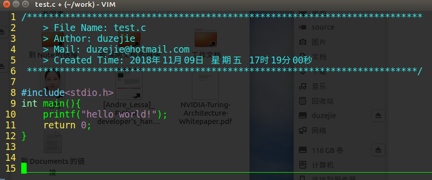

# Vim config file 

## What is it?

It is a simple and sole config file for vim.

The origin vim is hard to use, and very ugly. The file '.vimrc' in this directory can easily improve vim.




## How to install.
It is very easy to begin.

When you are in linux, just copy the file '.vimrc' to your home/ directory.
Such as:
```shell
git clone https://github.com/zejiedu/dev-tools.git
cd dev-tools/vim
cp .vimrc ~/
vim 
```
Now you can enjoy it.


## What it can do.

1.high light your code.
2.auto install head information when you create a new code file by vim. Note: only suport C/C++/shell.
3.it is easy for your eyes.
4.Friendly for Chinese. (内有中文注释，方便做出各种个性设置)
5. ...


